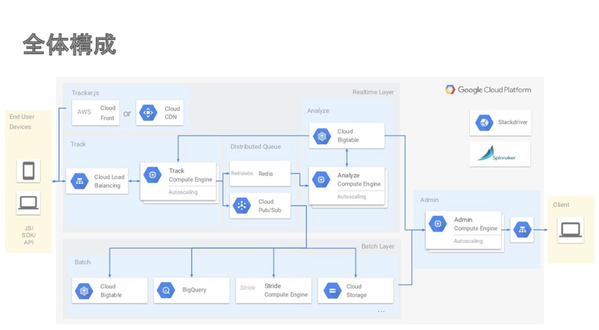
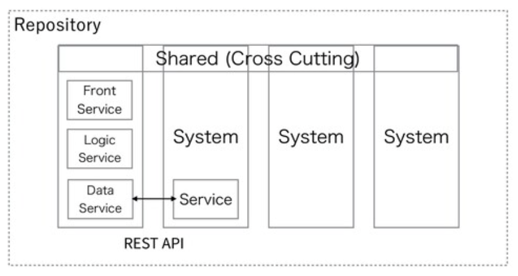

# アンチパターンから学ぶマイクロサービス

2021-01-13
Microservices Study

Plaid, Inc.
山内 雅浩

---

## 自己紹介

- 所属: 株式会社プレイド
- 氏名: 山内 雅浩 
- github: [@algas](https://github.com/algas)

- 趣味: 狩猟、料理、筋トレ
- 最近勉強してること: 秘密計算、耐量子計算機暗号

---

## 発表概要

1. サービスの構成
1. アンチパターンと回避の実例
   - Data-Driven Migration AntiPattern
   - Reach-In Reporting AntiPattern
   - The Static Contract Pitfall
   - Grains of Sand Pitfall
   - The "I was taught to share" AntiPattern
1. その他のアンチパターン

---

## サービスの構成

KARTE のサービス構成図

- [Migrating to Microservices](https://speakerdeck.com/komukomo/migrating-to-microservices)

---

## アンチパターンと回避の実例

今回紹介するアンチパターン名は [Microservices antipatterns and pitfalls](https://www.oreilly.com/content/microservices-antipatterns-and-pitfalls/) を引用しました
1. Data-Driven Migration AntiPattern
1. Reach-In Reporting AntiPattern
1. The Static Contract Pitfall
1. Grains of Sand Pitfall
1. The "I was taught to share" AntiPattern

---

## アンチパターン 1
### Data-Driven Migration AntiPattern

- Anti Pattern: データを先に移行するな
- Solution: 機能を先にデータは後に

---

## アンチパターンの回避 1
### Data-Driven Migration AntiPattern

モノリスからマイクロサービスへ
- フロントエンドから先に移行した
- バックエンドは後で移行した
- ほとんどモノレポ

詳しくは次の資料で
- [急速な成長を加速させるアーキテクチャ](https://tech.plaid.co.jp/cndt2020tokyo/)

---

## アンチパターン 2
### Reach-In Reporting AntiPattern

- Anti Pattern: レポート作成機能がサービスを跨っている
- Solution: 非同期イベントプッシュを使うべき

---

## アンチパターンの回避 2
### Reach-In Reporting AntiPattern

レポートデータ
- (一部の)レポートデータを BigQuery にまとめた
- リアルタイムレスポンスが必要なレポートにはキャッシュを使った

詳しくはエンジニアブログで
- [BigQueryの監査ログは役に立つ](https://tech.plaid.co.jp/bigquery_audit_log_useful/)
- [プレイドのCTOが登壇しました！ 〜Google Cloud Next '19 in SFレポート〜](https://tech.plaid.co.jp/google-cloud-next-19-in-sf/)

---

## アンチパターン 3
### The Static Contract Pitfall

- Anti Pattern: コントラクトのバージョン管理をしてない
- Solution: 2つの解決パターン
   - Header Versioning: バージョン番号をリクエストヘッダーに入れる
   - Schema Versioning: バージョン番号をリクエストスキーマに入れる

---

## アンチパターンの回避 3
### The Static Contract Pitfall

秘密情報の管理
- Schema Versioning
- 秘密情報の管理に Secret Manager を使った
- k8s では External Secret で秘密情報を管理している

詳しくはエンジニアブログで
- [悩みに悩んだ Kubernetes Secrets の管理方法、External Secrets を選んだ理由](https://tech.plaid.co.jp/nayanda-kubernetes-secret-management/)

---

## アンチパターン 4
### Grains of Sand Pitfall

- Anti Pattern: マイクロサービスの粒度が細かすぎ
- Solution: 3つの解決パターン
   - サービスのスコープと機能を分析する
   - データベーストランザクションを分析する
   - サービスのコレオグラフィーを分析する

---

## アンチパターンの回避 4
### Grains of Sand Pitfall

- チームの境界とサービスの境界を合わせる
- 逆コンウェイの法則
- まだ発展途上で永遠の課題

詳しくはエンジニアブログで
- [プレイド開発チームにおけるチーム・ジャーニー](https://speakerdeck.com/kadoppe/pureidokai-fa-timuniokerutimuziyani)
- [Self Contained Systemsの紹介](https://tech.plaid.co.jp/self-contained-systems/)
- [GKEにおけるセキュリティ対策と運用](https://inthecloud.withgoogle.com/anthos-day-2001/Google_Cloud_Anthos_Day_200130_Session5.pdf)

---

## アンチパターン 5
### The "I was taught to share" AntiPattern

- Anti Pattern: 何も考えずに共有するな
- Solutions: 4つの解決パターン
   - Shared Project: 共有プロジェクト
   - Shared Library: 共有ライブラリ
   - Replication: 複製
   - Consolidation: 共有しない

---

## アンチパターンの回避 5
### The "I was taught to share" AntiPattern

4つを使い分けた
- 共有プロジェクトは簡単だけどバージョン管理できてない
- 共有ライブラリを使えばバージョン管理できる
- バージョン管理できるように移行中（対応するのは難しい）

---

### その他のアンチパターン

- [Microservices antipatterns and pitfalls](https://www.oreilly.com/content/microservices-antipatterns-and-pitfalls/) 
- [Microservices Anti-Patterns: A Taxonomy](https://arxiv.org/pdf/1908.04101.pdf)
- [Microservices adoption antipatterns](https://microservices.io/microservices/antipatterns/-/the/series/2019/06/18/microservices-adoption-antipatterns.html)

---

## まとめ

- アンチパターンから学んでマイクロサービスの構築に役立てた
- 既知のアンチパターンを全部回避できたわけではない
- これから新しいパターンやアンチパターンを確立していきたい
